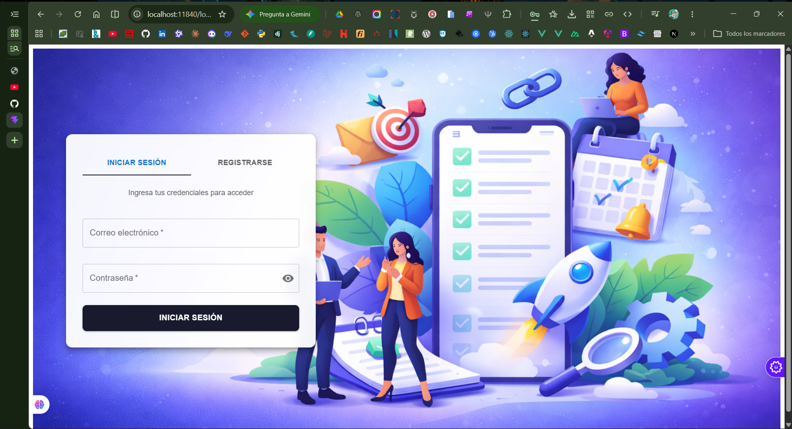
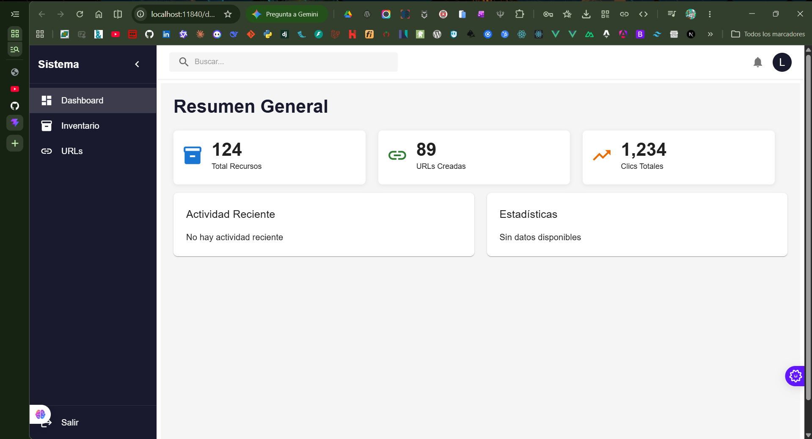

# Proyecto Personal

> Full-stack enterprise application with .NET 10.0 backend and React + MUI frontend.

[](https://dotnet.microsoft.com/)
[](https://dotnet.microsoft.com/apps/aspnet)
[](https://react.dev/)
[](https://www.typescriptlang.org/)
[](https://mui.com/)
[](https://www.microsoft.com/sql-server)
[](LICENSE)

## Overview

Proyecto Personal is a modern full-stack application demonstrating enterprise-grade architecture with Clean Architecture principles. It features secure authentication, inventory management with stock threshold alerts, and a URL shortener with click analytics.

## Features

### Authentication System
- JWT-based authentication with access and refresh tokens
- ASP.NET Core Identity integration
- Secure password hashing and validation
- Token refresh and revocation mechanisms

### Inventory Management
- Stock control with real-time tracking
- Minimum threshold alerts for critical stock levels
- Stock deduction with validation
- Prevention of negative stock transactions

### URL Shortener
- Custom short code generation
- Click tracking and analytics
- High-performance statistics queries using Dapper
- Automatic redirection with click registration

## Technology Stack

### Backend
| Component | Technology |
|-----------|------------|
| Framework | ASP.NET Core 10.0 |
| Language | C# 12 |
| ORM | Entity Framework Core 10.0 |
| Query Performance | Dapper 2.1.72 |
| Authentication | JWT Bearer Tokens |
| Database | SQL Server Express |
| API Documentation | Swagger/OpenAPI |

### Frontend
| Component | Technology |
|-----------|------------|
| Framework | React 19 |
| Language | TypeScript 6.0 |
| Build Tool | Vite 8.0 |
| UI Library | Material-UI 9.0 |
| Routing | React Router 7 |
| Styling | Styled Components 6 |

## Getting Started

### Prerequisites

- [.NET 10.0 SDK](https://dotnet.microsoft.com/download/dotnet/10.0)
- [SQL Server Express](https://www.microsoft.com/sql-server/sql-server-downloads)
- [Node.js 18+](https://nodejs.org/) (for frontend)
- [Git](https://git-scm.com/)

### Installation

1. **Clone the repository**

```powershell
git clone https://github.com/PushoDev/Proyecto-Personal-Recordando.git
cd Proyecto-Personal-Recordando
```

2. **Restore and build the backend**

```powershell
dotnet restore ProyectoPersonal.slnx
dotnet build ProyectoPersonal.slnx
```

3. **Configure the database connection**

Update `ApiProyecto/appsettings.json` with your SQL Server connection string:

```json
{
  "ConnectionStrings": {
    "DefaultConnection": "Server=.\\SQLEXPRESS;Database=ProyectoPersonalDb;Trusted_Connection=True;TrustServerCertificate=True;MultipleActiveResultSets=true"
  }
}
```

4. **Run database migrations**

```powershell
dotnet ef database update --project Infraestructura --startup-project ApiProyecto
```

5. **Start the backend API**

```powershell
cd ApiProyecto
dotnet run
```

The API will be available at `http://localhost:5241`

6. **Install and start the frontend**

```powershell
cd frontend
npm install
npm run dev
```

The frontend will be available at `http://localhost:5173`

## Architecture

The solution follows Clean Architecture principles with four distinct layers:

```
ProyectoPersonal/
├── ApiProyecto/           # Presentation Layer
│   ├── Controllers/       # API endpoints
│   ├── Program.cs        # Application entry point
│   └── appsettings.json  # Configuration
├── Application/           # Business Logic Layer
│   ├── Services/         # Use cases and business orchestration
│   └── DTOs/             # Data transfer objects
├── Domain/                # Domain Layer
│   ├── Entities/         # Business entities
│   └── Interfaces/       # Repository contracts
└── Infraestructura/       # Data Access Layer
    ├── Data/              # EF Core DbContext
    ├── Repositories/      # Repository implementations
    └── Migrations/        # Database migrations
```

## Screenshots

### Authentication Interface



### Dashboard



## API Documentation

### Authentication Endpoints

| Method | Endpoint | Description |
|--------|----------|-------------|
| POST | `/api/auth/register` | Register a new user |
| POST | `/api/auth/login` | Authenticate user |
| POST | `/api/auth/refresh` | Refresh access token |
| POST | `/api/auth/revoke` | Revoke refresh token |

### Resource Management

| Method | Endpoint | Description |
|--------|----------|-------------|
| GET | `/api/recursos` | List all resources |
| GET | `/api/recursos/{id}` | Get resource by ID |
| PUT | `/api/recursos/{id}/stock` | Update stock quantity |

### URL Shortener

| Method | Endpoint | Description |
|--------|----------|-------------|
| POST | `/api/urlshortener/shorten` | Create short URL |
| GET | `/api/urlshortener/{code}` | Redirect to original URL |
| GET | `/api/urlshortener/{code}/stats` | Get click statistics |

### Swagger UI

Access interactive API documentation at: `http://localhost:5241/swagger`

## Configuration

### JWT Settings

Configure JWT parameters in `ApiProyecto/appsettings.json`:

```json
{
  "Jwt": {
    "Key": "YourSecretKey...",
    "Issuer": "ProyectoPersonal",
    "Audience": "ProyectoPersonalUsers",
    "ExpiryInMinutes": 60,
    "RefreshTokenExpiryInDays": 7
  }
}
```

### Environment Ports

| Service | Default Port |
|---------|--------------|
| Backend API | 5241 |
| Frontend Dev Server | 5173 |
| Swagger UI | 5241/swagger |

## Project Structure (Frontend)

```
frontend/src/
├── api/           # API client configuration
├── components/    # Reusable React components
├── context/       # React context providers
├── pages/         # Route page components
├── types/         # TypeScript type definitions
└── App.tsx        # Main application component
```

## Contributing

1. Fork the repository
2. Create a feature branch (`git checkout -b feature/AmazingFeature`)
3. Commit your changes (`git commit -m 'Add AmazingFeature'`)
4. Push to the branch (`git push origin feature/AmazingFeature`)
5. Open a Pull Request

## License

This project is licensed under the MIT License - see the [LICENSE](LICENSE) file for details.

---

**Built with .NET 10.0 and React 19**
